# Database ERD (Local Storage JSON Structure)

```mermaid
erDiagram
    USERS ||--o{ TRANSACTIONS : has
    
    USERS {
        string id PK "Unique identifier (UUID or timestamp)"
        string username "User's login name"
        string password "User's password"
        number monthlyLimit "User's set limit for monthly expenses"
    }

    TRANSACTIONS {
        string id PK "Unique transaction ID"
        string userId FK "References USERS.id"
        string type "Enum: 'income' | 'expense'"
        number amount "Transaction amount"
        string category "Makanan & Minuman, Transportasi, Belanja, Gaji / Pendapatan, Investasi, Temen Ngutang"
        string description "Optional text description"
        string date "ISO Date string (YYYY-MM-DD)"
    }
```



## JSON Structure Details

Data will be stored in `localStorage` under two main keys:

### 1. `fintjam_users`
An array of user objects.
```json
[
  {
    "id": "1678886400000",
    "username": "gamer123",
    "password": "hashed_or_plain_password",
    "monthlyLimit": 5000000
  }
]
```

### 2. `fintjam_transactions`
An array of all transaction objects.
```json
[
  {
    "id": "tx_12345",
    "userId": "1678886400000",
    "type": "expense",
    "amount": 50000,
    "category": "Makanan & Minuman",
    "description": "Makan siang KFC",
    "date": "2026-05-09"
  },
  {
    "id": "tx_12346",
    "userId": "1678886400000",
    "type": "expense",
    "category": "Temen Ngutang",
    "amount": 100000,
    "description": "Budi pinjam uang",
    "date": "2026-05-09"
  }
]
```

### 3. `fintjam_currentUser`
Stores the ID of the currently logged-in user to maintain session.
```json
"1678886400000"
```
