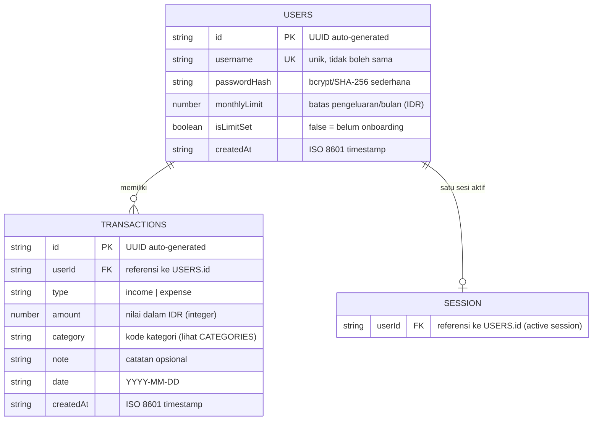

# FINTJAM — Plan 02: ERD & Skema LocalStorage

> Dokumen ini mendefinisikan struktur data yang disimpan di LocalStorage sebagai
> pengganti database. Semua relasi dimodelkan menggunakan referensi ID (foreign key manual).

---

## 1. Entity Relationship Diagram (ERD)



---

## 2. Skema LocalStorage Keys

Semua data disimpan di `localStorage` dengan key berikut:

| Key                    | Tipe Data       | Deskripsi                                          |
|------------------------|-----------------|----------------------------------------------------|
| `fintjam_users`        | `Array<User>`   | Semua akun pengguna yang terdaftar                 |
| `fintjam_transactions` | `Array<Transaction>` | Semua transaksi semua pengguna              |
| `fintjam_session`      | `Object`        | Sesi aktif: `{ userId: string }`                   |

> **Prefix `fintjam_`** digunakan untuk menghindari konflik dengan aplikasi lain di domain yang sama.

---

## 3. Definisi Entitas

### 3.1 Entity: `User`

```json
{
  "id": "usr_1715234567890_abc123",
  "username": "CyberJammer99",
  "passwordHash": "5e884898da28047151d0e56f8dc6292773603d0d6aabbdd62a11ef721d1542d8",
  "monthlyLimit": 5000000,
  "isLimitSet": true,
  "createdAt": "2026-05-09T04:25:00.000Z"
}
```

| Field          | Tipe      | Validasi                                      |
|----------------|-----------|-----------------------------------------------|
| `id`           | string    | Format: `usr_{timestamp}_{random5char}`       |
| `username`     | string    | Min 3 char, max 20 char, alphanumeric + underscore, unik |
| `passwordHash` | string    | SHA-256 dari password plaintext               |
| `monthlyLimit` | number    | Integer positif, min 0                        |
| `isLimitSet`   | boolean   | `false` saat register, `true` setelah onboarding |
| `createdAt`    | string    | ISO 8601 format                               |

### 3.2 Entity: `Transaction`

```json
{
  "id": "txn_1715234600000_xyz789",
  "userId": "usr_1715234567890_abc123",
  "type": "expense",
  "amount": 45000,
  "category": "food_drink",
  "note": "Makan siang tim",
  "date": "2026-05-09",
  "createdAt": "2026-05-09T12:00:00.000Z"
}
```

| Field       | Tipe    | Validasi                                         |
|-------------|---------|--------------------------------------------------|
| `id`        | string  | Format: `txn_{timestamp}_{random5char}`          |
| `userId`    | string  | Harus match dengan `User.id` yang sedang login   |
| `type`      | string  | Enum: `"income"` atau `"expense"`                |
| `amount`    | number  | Integer positif, min 1                           |
| `category`  | string  | Enum kode kategori (lihat section 4)             |
| `note`      | string  | Opsional, max 100 char                           |
| `date`      | string  | Format `YYYY-MM-DD`, tidak boleh masa depan     |
| `createdAt` | string  | ISO 8601 format                                  |

### 3.3 Entity: `Session`

```json
{
  "userId": "usr_1715234567890_abc123"
}
```

> Session dihapus saat logout. Tidak ada expiry time — session persists sampai logout manual.

---

## 4. Referensi Kategori

Kategori adalah konstanta (tidak disimpan di LocalStorage, didefinisikan di `utils.js`).

```javascript
const CATEGORIES = {
  food_drink: {
    label: "Makanan & Minuman",
    icon: "restaurant",
    type: ["expense"]         // hanya untuk pengeluaran
  },
  transport: {
    label: "Transportasi",
    icon: "directions_car",
    type: ["expense"]
  },
  shopping: {
    label: "Belanja",
    icon: "shopping_bag",
    type: ["expense"]
  },
  salary: {
    label: "Gaji / Pendapatan",
    icon: "account_balance",
    type: ["income"]          // hanya untuk pemasukan
  },
  investment: {
    label: "Investasi",
    icon: "trending_up",
    type: ["income", "expense"] // bisa keduanya
  },
  debt_friend: {
    label: "Temen Ngutang",
    icon: "group",
    type: ["income", "expense"]  // bisa keduanya
  }
};
```

---

## 5. Operasi CRUD (API LocalStorage)

Semua operasi diimplementasikan di `js/storage.js`:

### Users
```javascript
Storage.getUsers()                    → Array<User>
Storage.getUserById(id)               → User | null
Storage.getUserByUsername(username)   → User | null
Storage.createUser(userData)          → User
Storage.updateUser(id, updates)       → User
```

### Transactions
```javascript
Storage.getTransactions()                     → Array<Transaction>
Storage.getTransactionsByUser(userId)         → Array<Transaction>
Storage.getTransactionsByUserAndMonth(userId, year, month) → Array<Transaction>
Storage.createTransaction(txnData)            → Transaction
Storage.deleteTransaction(id)                 → boolean
```

### Session
```javascript
Storage.getSession()                  → Session | null
Storage.setSession(userId)            → void
Storage.clearSession()                → void
```

---

## 6. Kalkulasi Finansial

Semua kalkulasi dilakukan real-time dari data LocalStorage:

```
Total Saldo      = Σ income.amount - Σ expense.amount (semua waktu, per user)
Pemasukan Bulan  = Σ income.amount  (bulan & tahun saat ini, per user)
Pengeluaran Bln  = Σ expense.amount (bulan & tahun saat ini, per user)
Sisa Limit       = User.monthlyLimit - Pengeluaran Bulan
Persentase Limit = (Pengeluaran Bulan / User.monthlyLimit) × 100
```

**Trigger Toast Alert:**
- Muncul jika `Persentase Limit >= 80%`
- Pesan berbeda:
  - 80–99%: "⚠ Limit hampir tercapai! Pengeluaran Anda sudah X% dari limit."
  - ≥100%: "🚨 Limit pengeluaran bulan ini telah terlampaui!"

---

## 7. Contoh Data Seed (Testing)

```json
// fintjam_users
[
  {
    "id": "usr_0000000000001_demo1",
    "username": "demo",
    "passwordHash": "...",
    "monthlyLimit": 3000000,
    "isLimitSet": true,
    "createdAt": "2026-01-01T00:00:00.000Z"
  }
]

// fintjam_transactions (sample)
[
  { "id": "txn_001", "userId": "usr_0000000000001_demo1", "type": "income",  "amount": 5000000, "category": "salary",     "note": "Gaji Mei",       "date": "2026-05-01" },
  { "id": "txn_002", "userId": "usr_0000000000001_demo1", "type": "expense", "amount": 45000,   "category": "food_drink", "note": "Makan siang",    "date": "2026-05-05" },
  { "id": "txn_003", "userId": "usr_0000000000001_demo1", "type": "expense", "amount": 150000,  "category": "transport",  "note": "Bensin seminggu","date": "2026-05-06" }
]
```
